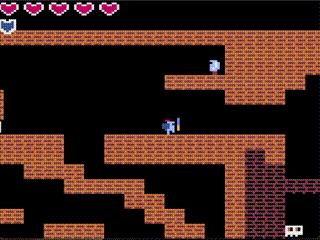
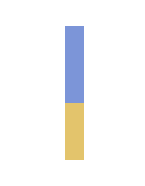
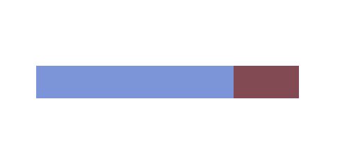
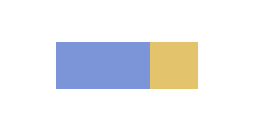
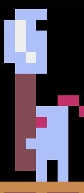
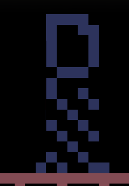
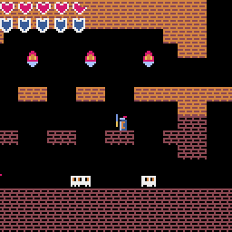
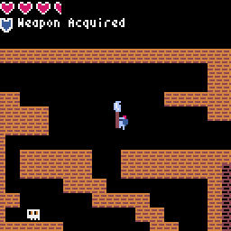
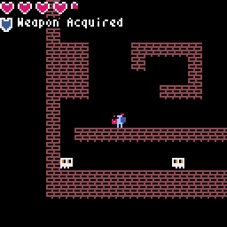
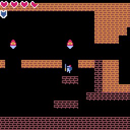

# ⚔️ Dungeon Explorer ⚔️

**A retro nes style dungeon crawler built in Python with Pyxel**

## About

A side-scrolling action game exploring a dungeon. Features multiple weapons and shields, a shield break system, boss fights, and two playable characters.

## The Game

### How to Play

Try it on my [portfolio site](https://jtsoco.github.io/portfolio/)

Controls:

| Key | Action |
|-----|--------|
| ⬅️ ➡️ | Move |
| Space | Jump |
| D | Attack |
| S | Block |
| Tab | Pause / Inventory |
| Enter | Confirm |

### Characters

Choose your adventurer at the start screen.
| Name | Image | Weapon | Shield | Info |
| ------- | ----- | ---- | --- | ------- |
| Knight | {width=88} | {height=88} | {width=88} | Sturdy shield and trustworthy sword, can last a while in combat without breaking. |
| Ronin | {width=88} | {width=88} | {width=88} | Quick to attack and quick to block, excels in fast combat. However, when blocking the guard is soon to break. |

### Bestiary

| Name | Enemy | Description | Danger |
| ----- | ---- | ----------- | ------ |
| Skull | {width=88} | A simple skull enemy, roams the map. Has touch damage. | ☠️ |
| Dark Knight | {width=88} | A dark knight, will pursue when trespassers are close. | ☠️☠️ |
| Winged Knight | {width=88} | The first boss. Defeating it will earn you the double jump ability, but beware, it's glaive is deadly. | ☠️☠️☠️ |
| Dark Lord | {width=88} | The final boss. Beware the flame he wields. | ☠️☠️☠️☠️ |

### Arsenal

Weapons

| Gif | Weapon | Damage | Style | Location |
| --- | ------ | ------ | ----- | -------- |
| {width=300} | Shortsword | 50 | Strong, reliable all rounder. | Knight default |
| {width=300} | Katana | 50 | Fast to attack, but low knockback. | Ronin default |
| {width=300} | Glaive | Heavy melee with an air attack | Map pickup |
| {width=300} | Fire Blast | 30 | Ranged flame stream, low damage but good knockback | Map pickup |

Shields

| Gif | Shield | Stamina | Style | Location |
| --- | ------ | ------ | ----- | -------- |
| {width=300} | Iron Shield | 100 | Balanced blocker | Knight default |
| {width=300} | Parry Dagger | 50 | Quick Parry, fast stamina regen, but quick to break. | Ronin default |
| {width=300} | Tower Shield | 500 | Massive shield, slow to block but hard to break. | Map pickup |

**Shield Break**: Every block drains stamina. If your stamina hits zero, your shield breaks and you can't block until shield recovery and stamina regens. Time your blocks carefully.

### The World

The dungeon is a simple 6x2 grid of rooms that load and unload dynamically as you explore, lending itself to being added onto without worries of performance. Each room is populated with enemies, items, and boundaries - step through a rooms boundary and rooms just out of reach will load ready for you to come close.

Health drops from enemies (30% chance), along with weapons, shields, and health pickups scattered around the map are yours to find. Access your inventory from the pause menu to swap gear as you go.

## Under the Hood

Tech Stack

- Python + [Pyxel](https://github.com/kitao/pyxel) - retro game engine, 128x128 resolution, 16 colors, 4 sound channels
- All assets were created by me using pyxels built in editor, saved in the dungeon_explorer_assets.pyxres resource file.
